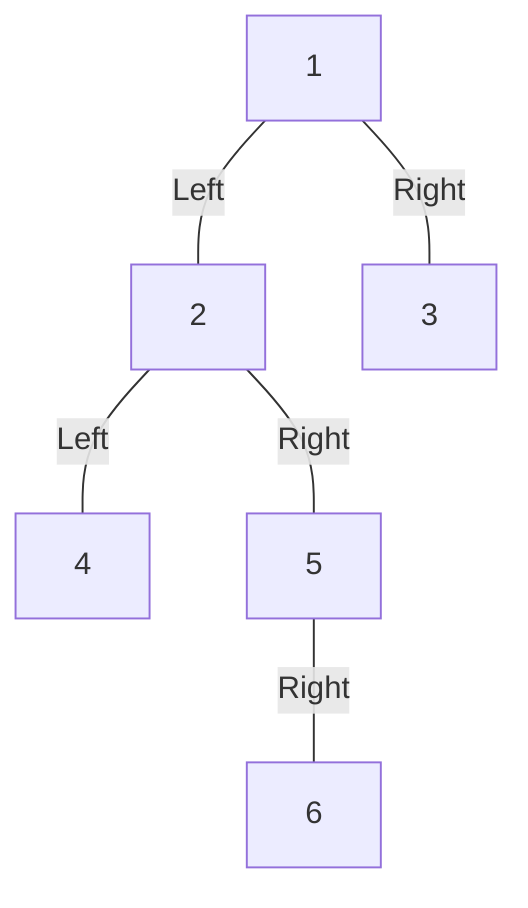

# Stree

Stree is a multi-way tree container library with contracts in SPARK.

## License

Apache 2.0.

## Example

This example creates a binary tree (a 2-way tree with directions
Left and Right from each node) containing integer elements, with the following
structure:



```ada
declare
   --  Way_Type determines the order of the tree (i.e. the number of branches
   --  from each node). This example creates a binary tree with two ways from
   --  each node: Left and Right.
   type Way_Type is (Left, Right);

   package BTrees is new Stree.Unbounded_Multiway_Trees
     (Element_Type => Integer,
      Way_Type     => Way_Type);

   Container : BTrees.Tree;
   Node_2    : BTrees.Cursor;
   Node_5    : BTrees.Cursor;
begin
   --  Create root node
   BTrees.Insert_Root (Container, 1);

   --  Insert values 2 and 3 as children of the root node
   BTrees.Insert_Child (Container, 2, Root (Container), Left);
   BTrees.Insert_Child (Container, 3, Root (Container), Right);

   --  Insert values 4 and 5 as children of node 2 (left of the root node)
   Node_2 := BTrees.Child (Container, Root (Container), Left);
   BTrees.Insert_Child (Container, 4, Node_2, Left);
   BTrees.Insert_Child (Container, 5, Node_2, Right);

   --  Insert value 6 as the Right child of node 5 (right of node 2)
   Node_5 := BTrees.Child (Container, Node_2, Right);
   BTrees.Insert_Child (Container, 6, Node_5, Right);
end;
```
